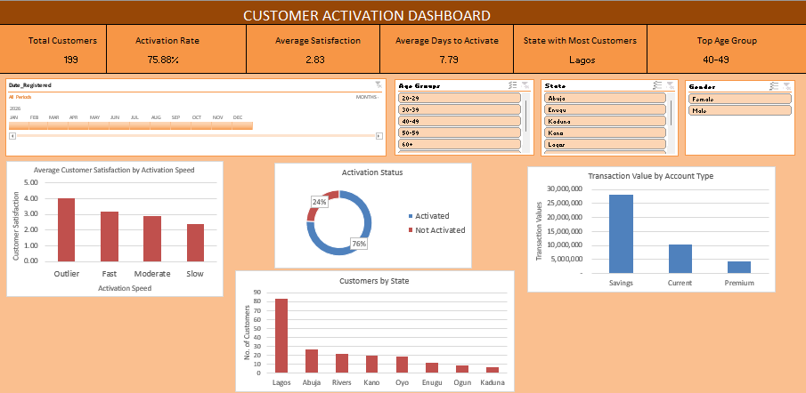

# Customer Activation & Satisfaction Analysis

## Overview

An Excel-based customer analysis project focused on understanding customer activation, satisfaction, registration patterns, and transaction activity.

The project uses PivotTables, charts, KPI cards, and slicers to turn customer data into an interactive dashboard and useful business insights.

## Dashboard

## What I Analyzed

- Customer activation rate and activation status
- Average days to activate an account
- Customer satisfaction and activation speed
- Customer registration by state
- Customer registration by age group
- Transaction value by account type
- Potential activation outliers

## Key Insights

- 75.88% of customers were activated.
- The average activation time was approximately 8 days.
- One customer took 45 days to activate, which may represent a potential outlier.
- Customer satisfaction appears relatively low and may be affected by factors such as activation speed, invalid transactions, and transaction reversals.
- Lagos had the highest number of registered customers, with 83.
- Kaduna had the lowest number of registered customers, with 7.
- Customers aged 40–49 had the most registrations.
- Savings accounts generated the highest monthly transaction value at 27,998,220.

## Tools Used

- Microsoft Excel
- PivotTables
- PivotCharts
- Slicers
- Excel formulas
- Data visualization

## Project Structure

- `Raw Data` – Original customer dataset
- `Pivot Tables` – Supporting analysis and calculations
- `Dashboard` – Interactive dashboard
- `Project Insights` – Key findings and areas for further investigation

## Recommendations

The analysis suggests investigating unusually long activation times, the relationship between activation issues and customer satisfaction, and the reasons behind lower customer registration in Kaduna.
